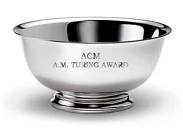

  
  <h1 class="display-5 fw-bold text-body-emphasis">열린 튜링: 튜링상 업적 해설 강연</h1>
  

    

    컴퓨터 분야의 노벨상이라 불리는 튜링상 수상자들의 
    과거 업적을 기리고,  
    현재 의미를 되짚어보며, 
    미래 컴퓨팅을 그리는 자리.
    

  

  <h2 class="pb-2 border-bottom">소개</h2>
  <h4><b>열린 튜링</b>은 컴퓨터 분야의 노벨상에 해당하는 튜링상 수상자의 업적 해설 강연입니다.
  매년 그 해 수상 업적과 과거의 두 수상 업적을 선정하여 알기 쉽게 풀어 설명하는 자리를 마련했습니다.
  KAIST 전산학부, 서울대 컴퓨터공학부, 포항공대 컴퓨터공학과가 함께 개최하고, 세 학교의 교수진이 해설을 맡습니다.
  2023년부터 KAIST, 서울대, 포항공대에서 번갈아가며 열립니다.
  </h4>

  <h2 class="pb-2 border-bottom">일시 및 장소</h2>
  <h4>2024년 5월 23일 16시 서울대학교 302동 105호</h4>

  <h2 class="pb-2 border-bottom">생중계</h2>
  <h4>본 강연은 <a href="https://www.youtube.com/live/0K0pEduKKWI?si=CdKnq9DEfHRHnKNP">유투브로 생중계</a> 될 예정입니다.</h4>

  <h2 class="pb-2 border-bottom">강연자</h2>
  

    

      

        
      

      

        <svg class="bi" width="1em" height="1em"><use xlink:href="#collection"/></svg>
      

      
<h3 class="fs-3">Prof. Chenglin Fan</h3>

      
<h5 class="fs-4">서울대 컴퓨터공학부</h5>

      

        <h5 class="fs-5">
        2023년 수상 업적 해설
        </h5>
      

      

        수상자:
        <a href="https://amturing.acm.org" class="icon-link">A. Wigderson</a>
      

    

    

      

        
      

      

        <svg class="bi" width="1em" height="1em"><use xlink:href="#people-circle"/></svg>
      

      
<h3 class="fs-3">김은정 교수</h3>

      
<h5 class="fs-4">KAIST 전산학부</h5>

      

        <h5 class="fs-5">
          2023년 수상 업적 해설
        </h5>
      

      
수상자:
        <a href="https://amturing.acm.org" class="icon-link">A. Wigderson</a>
      

    

    

      

        
      

      

        <svg class="bi" width="1em" height="1em"><use xlink:href="#people-circle"/></svg>
      

      
<h3 class="fs-3">강지훈 교수</h3>

      
<h5 class="fs-4">KAIST 전산학부</h5>

      

        <h5 class="fs-5">
          2013년 수상 업적 해설
        </h5>
      

      

        수상자:
        <a href="https://amturing.acm.org/award_winners/lamport_1205376.cfm" class="icon-link">L. Lamport</a>
      

    

    

      

        
      

      

        <svg class="bi" width="1em" height="1em"><use xlink:href="#people-circle"/></svg>
      

      
<h3 class="fs-3">황인석 교수</h3>

      
<h5 class="fs-4">포항공대 컴퓨터공학과</h5>

      

        <h5 class="fs-5">
          2003년 수상 업적 해설
        </h5>
      

      

        수상자:
        <a href="https://amturing.acm.org/award_winners/kay_3972189.cfm" class="icon-link">A. Kay</a>
      

    

  

   
  <h2 class="pb-2 border-bottom"></h2>
  

